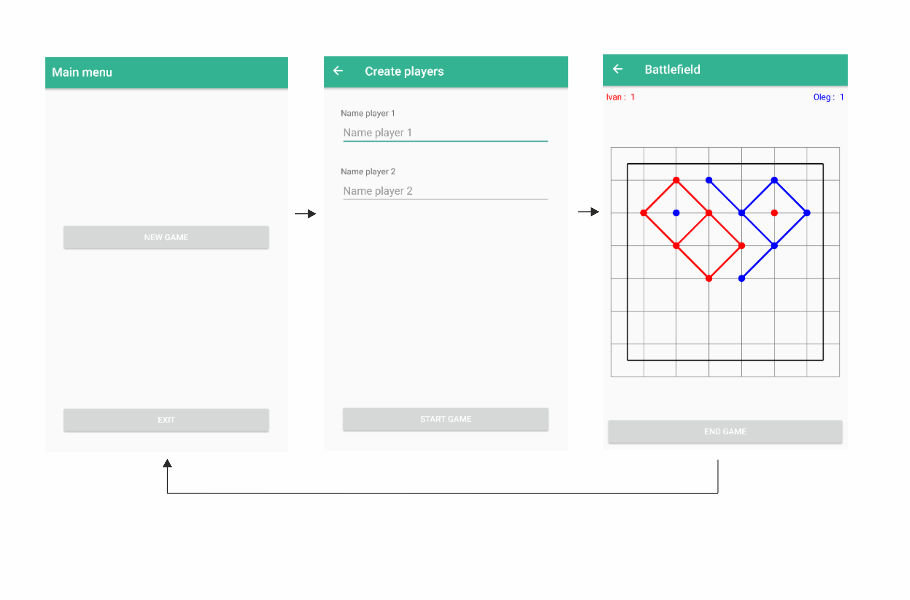

# Dot Game
## 👋
Dots is a strategic board game for two players. It involves placing colored dots on a square playing field. The objective is to enclose the opponent's points by creating a continuous chain of your own dots around them.
## Navigation

The application navigation is presented in the image above. 

There are 3 screens: 
* Main menu screen.
* Player creation screen.
* Battle field screen.

 Arrows indicate how to get to a particular screen, depending on which screen is currently active. A little explanation about the Battle field screen. When players fill in all the points on the field or press the early game end button, they will be redirected to the main menu.

 ## Custome view code location
 The code of the custom view is located in a separate module called "dot_game_view_module".

